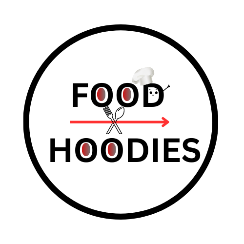

<div align="center">  
  <h2><b> FOOD-HOODIES </b></h2>
  
</div>

<a name="readme-top"></a>

<!-- TABLE OF CONTENTS -->

# 📗 Table of Contents

- [📖 About the Project](#about-project)
  - [🛠 Built With](#built-with)
    - [Tech Stack](#tech-stack)
    - [Key Features](#key-features)
  - [🚀 Live Demo](#live-demo)
  - [Walkthrough](#walkthrough)
- [💻 Getting Started](#getting-started)
  - [Setup](#setup)
  - [Prerequisites](#prerequisites)
  - [Usage](#usage)
  - [Run tests](#run-tests)
  - [Deployment](#deployment)
- [👥 Authors](#authors)
- [🔭 Future Features](#future-features)
- [🤝 Contributing](#contributing)
- [⭐️ Show your support](#support)
- [🙏 Acknowledgements](#acknowledgements)
- [📝 License](#license)

<!-- PROJECT DESCRIPTION -->

# 📖 Capstone: FOOD-HOODIES <a name="about-project"></a>

**Capstone: FOOD-HOODIES** is a web app that interactes with APIs and displays data based on the selected API where you can see more detailed information in a popup of respected item cards displayed on the home page. You can also add likes and comments to the cards using API interactions.

## 🛠 Built With <a name="built-with"></a>

### Tech Stack <a name="tech-stack"></a>

<details>
  <summary>Client</summary>
  <ul>
    <li><a href="https://www.w3schools.com/html/">HTML</a></li>
    <li><a href="https://www.w3schools.com/css/default.asp">CSS</a></li>
    <li><a href="https://www.w3schools.com/javascript/default.asp">JavaScript</a></li>
  </ul>
</details>

<!-- Features -->

### Key Features <a name="key-features"></a>

- **Display Data based on the API selected by making a request**

- **Responsive Web design**

- **Displays Likes exisiting for each card**

- **Can add new Like to the card and update the display**

- **Displays a Popup on `comment` click event for respective cards**

- **Displays the comments present for each card**

- **Can add new comment to the card**

<p align="right">(<a href="#readme-top">back to top</a>)</p>

<!-- LIVE DEMO -->

## 🚀 Live Demo <a name="live-demo"></a>

- [Live Demo Link](https://tan12082001.github.io/Group-Capstone-JavaScript/)

<p align="right">(<a href="#readme-top">back to top</a>)</p>

<!-- WALKTHROUGH -->

## Walkthrough <a name="walkthrough"></a>

- [Loom Video]()

<p align="right">(<a href="#readme-top">back to top</a>)</p>

<!-- GETTING STARTED -->

## 💻 Getting Started <a name="getting-started"></a>
With this Project FOOD-HOODIES, you can get the working of APIs interacting and be able to perform features like add new likes, comments and display exisiting likes and comments.

To get a local copy up and running, follow these steps.

### Prerequisites

In order to run this project you need: Linters, Webpack, Jest

```sh
 npm init -y 

```

### Setup

Clone this repository to your desired folder:

```sh
  cd my-folder
  git clone git@github.com:tan12082001/Group-Capstone-JavaScript.git
```

### Usage

To run the project, if you are using a Code Editor make use of a live server.
If you are working with webpack you can run the local host with the following command.

```sh
  npm start
```

### Run tests

Using the Jest environment you can run the test files using the following command.

```sh
  npm test
```


<p align="right">(<a href="#readme-top">back to top</a>)</p>

<!-- AUTHORS -->

## 👥 Authors <a name="authors"></a>

👤 **Nji Wilsan Ndenge**

- GitHub: [@Wils-FOURR-speed](https://github.com/Wils-FOURR-speed)
- LinkedIn: [LinkedIn](https://www.linkedin.com/in/nji-wilsan-ndenge-47b7a826a/)

👤 **Tanmayi Manku**

- GitHub: [@tan12082001](https://github.com/tan12082001)
- LinkedIn: [LinkedIn](https://www.linkedin.com/in/tanmayi-manku-99195720a/)

<p align="right">(<a href="#readme-top">back to top</a>)</p>

<!-- FUTURE FEATURES -->

## 🔭 Future Features <a name="future-features"></a>

- [ ] **Making it as a single-page Web app with more than one type of area food items display**

- [ ] **Implement more detailed style with animations/transitions**

<p align="right">(<a href="#readme-top">back to top</a>)</p>

<!-- CONTRIBUTING -->

## 🤝 Contributing <a name="contributing"></a>

Contributions, issues, and feature requests are welcome!

Feel free to check the github page.

<p align="right">(<a href="#readme-top">back to top</a>)</p>

<!-- SUPPORT -->

## ⭐️ Show your support <a name="support"></a>

If you like this project give a star.

<p align="right">(<a href="#readme-top">back to top</a>)</p>

<!-- ACKNOWLEDGEMENTS -->

## 🙏 Acknowledgments <a name="acknowledgements"></a>

I would like to thank Microverse for providing the required lessons and tutorials for successfully completing the project.

[TheMealDB](https://www.themealdb.com/) - the free source used in the project.

<p align="right">(<a href="#readme-top">back to top</a>)</p>


<!-- LICENSE -->

## 📝 License <a name="license"></a>

This project is [MIT](./LICENSE) licensed.


<p align="right">(<a href="#readme-top">back to top</a>)</p>
